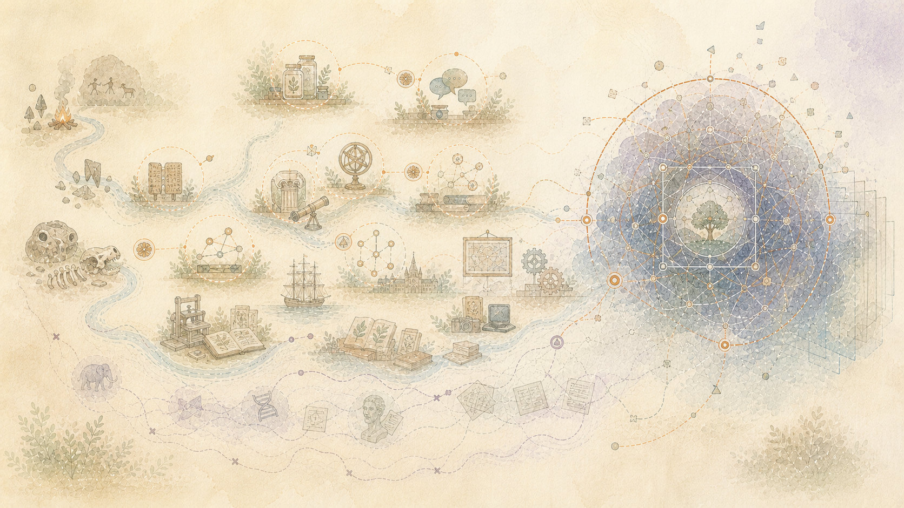

> العربية: الترجمة بمساعدة الآلة للمصدر الإنجليزي الرسمي. تصحيحات اللغة الأم هي موضع ترحيب. [إنجليزي](../../03-How-Knowledge-Changes-Without-Erasing-History.md) | [جميع اللغات](../README.md)

# احتفظ بالتصحيح دون محو الخطأ

فهم التغييرات. أدلة جديدة يمكن أن تصحح استنتاج سابق. يمكن أن يُظهر اختبار لاحق أن التفسير الأول كان خاطئًا. وهذا لا يجعل السجل السابق عديم القيمة.

وقد يفسر الخطأ سبب اتخاذ القرار، أو سبب ضياع الوقت، أو سبب وجود ضمانة الآن. إعادة كتابة المذكرة القديمة من شأنها أن تخفي هذا التاريخ.

## يمكن أن يكون لحدث واحد عدة تواريخ

التاريخ الموجود في الملف لا يمثل دائمًا تاريخ الحدث الموجود بداخله. قد يحتاج السجل المفيد إلى التمييز بين:

- عندما حدث شيء ما
- عندما كتبه شخص ما
- عندما تم حفظ الملف هنا
- عندما تم إجراء تفسير لاحق
- عندما أصبح الاستنتاج حاليًا أو تم استبداله

وإذا لم يكن أحد هذه التواريخ معروفا، فإنه يبقى مجهولا.

## مثال بسيط

ملاحظة مبكرة تلقي باللوم على الجزء المكسور. يُظهر اختبار لاحق أن إعداد الطاقة هو السبب الأكثر احتمالاً.

يجب أن يحتفظ التاريخ المصحح بالتشخيص المبكر والاختبار اللاحق والاستنتاج الجديد. يجب أن يوضح سبب تغير الاستنتاج. لا ينبغي تعديل الملاحظة الأولى لجعلها تبدو كما لو أن الجميع يعرفون الإجابة من البداية.

## لماذا النموذج الأحدث ليس الفصل التالي

تتغير نماذج اللغة أيضًا. تم إنشاء نموذج جديد من مزيج مختلف من المصادر واللغات والتسميات والتعليقات البشرية وقواعد المنتج. قد يكون أداؤها أفضل بشكل عام مع فقدان مرجع ثقافي أقدم أو ممارسة محلية أو نكتة أو تفسير الأقلية.

الإجابة الجديدة ليست تحديثًا كاملاً لمعرفة النموذج القديم. إنها إجابة جديدة من نموذج مختلف.

تسجل كل نتيجة النموذج الذي أنتجه، وما تم عرضه في النموذج، ومتى تم الرد عليه. يمكن إضافة إجابة أحدث دون استبدال الإجابة السابقة بصمت.

## اترك فجوات صادقة

في بعض الأحيان يُظهر السجل أن شيئًا ما قد تغير، ولكن ليس السبب. وفي هذه الحالة يبقى السبب مفتوحا.

تعد الفجوة المرئية أكثر فائدة من القصة الواثقة التي تم اختراعها لجعل الجدول الزمني يبدو مكتملاً.
