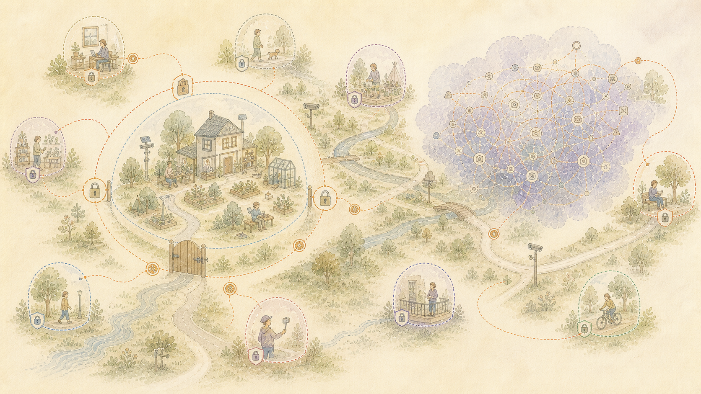

> العربية: الترجمة بمساعدة الآلة للمصدر الإنجليزي الرسمي. تصحيحات اللغة الأم هي موضع ترحيب. [إنجليزي](../../18-Use-Attribution-and-Limits.md) | [جميع اللغات](../README.md)

# ملاحظات الاستخدام العام والائتمان والخصوصية

يحتوي هذا المستودع على الشرح العام للمشروع، والمشاكل التي أدت إليه، وتصميم العمل، والنتائج المسجلة، والعمل المتبقي. ولا يحتوي على السجلات الخاصة التي يستخدمها التثبيت أو التفاصيل اللازمة للوصول إلى الخدمات الخاصة قيد التشغيل.

## كيف يتم تقديم المطالبات

تعتمد البيانات حول القدرات الحالية على سجلات واختبارات المشروع المحددة. تغطي المطالبة الجزء والشروط الموصوفة في ذلك الدليل. ولا يتم توسيعه إلى وعد بشأن كل سجل أو شخص أو تثبيت أو إصدار مستقبلي.

توضح أوصاف حالات فشل نماذج اللغة التجارية ما فعله المساعد وما حدث بعد ذلك في جلسات المشروع القديمة. ولا يقومون بتعيين دافع لمقدم الخدمة أو المطالبة بمعرفة سبب داخلي لم يتم الكشف عنه.

تصف الوثائق التدريب على نموذج اللغة بأنه مدمر عندما تبقى أنماط مفيدة ولكن لا يمكن استعادة المعنى الإنساني الكامل والتاريخ من النموذج المدرب. وهذا لا يعني أنه تم مسح العمل الأصلي في كل مكان أو أن مقدم الخدمة لم يحتفظ بنسخة منفصلة.

لا يعد هذا الوصف اتهامًا قانونيًا بالسرقة ولا يحدد ما إذا كان قد تم نسخ أي مادة معينة أو ترخيصها أو السماح بها أو استخدامها بشكل قانوني. تعتمد هذه الأسئلة على المادة والاستخدام والشروط المعمول بها والقانون.

## استقلال

هذا مشروع شخصي مستقل. تم تطويره في وقت شخصي، باستخدام معدات شخصية وخدمات ممولة شخصيًا.

إن الإشارات إلى أصحاب العمل أو المؤسسات أو الباحثين أو المشاريع العامة أو مقدمي نماذج اللغة أو المساهمين الآخرين لا تعني مشاركتهم أو تأييدهم أو شراكتهم أو موافقتهم.

## الخصوصية والأشخاص الآخرين

تتجاهل الملفات العامة السجلات والتفاصيل الخاصة التي يمكن أن تحدد هوية شخص ما بمفرده أو عند دمجها مع أدلة أخرى. كما أنهم يتركون معلومات صاحب العمل والعملاء وكلمات المرور وتفاصيل الاتصال الخاصة وتعليمات الوصول إلى السجلات الخاصة أو تشغيل الخدمات.

السيطرة على السجلات الخاصة لا تمنح السيطرة على شخص آخر. لا يؤدي الإذن باستخدام المواد الشخصية إلى إنشاء إذن بنشر هوية شخص آخر أو كلماته أو حقائقه الخاصة أو صورته أو تخمينات نموذج اللغة عنه.

## الحقوق والائتمان

لا يطالب المشروع بحقوق حصرية للحقائق أو الأفكار العامة أو الثقافات أو مجالات الدراسة أو الأعمال التي أنشأها الآخرون.

تحتفظ النصوص والصور والبرامج ومجموعات الأبحاث والمعايير العامة والأسماء والعلامات الخارجية بحقوقها وشروطها الخاصة. الائتمان ليس بديلاً عن الإذن عندما يكون الإذن مطلوبًا. ينطبق ترخيص وثائق هذا المشروع فقط على المواد التي يحددها.

## مساعدة من نماذج اللغة

ساعدت النماذج اللغوية في البحث والصياغة والترميز والمراجعة تحت التوجيه البشري. اختار الناشر المصادر، وفحص الادعاءات، وقبل أو رفض الصياغة، ووافق على الملفات الصادرة هنا.

لا يوجد مزود نموذج لغة يرعى المشروع أو يؤيده. لم يتم استخدام الاستجابات النموذجية المستخدمة أثناء التطوير لتدريب نموذج لغة عام بديل.

## لا توجد نصيحة مهنية أو نتيجة موعودة

تشرح هذه المستندات مشروع البرنامج الشخصي والأدلة المسجلة أثناء تطويره. وهي ليست مشورة قانونية أو طبية أو مالية أو توظيفية أو أمنية أو أي مشورة مهنية أخرى.

تصف هذه الوثائق القدرات المسجلة والأدلة التي تقف وراءها. إنهم لا يقدمون نصيحة مهنية أو يضمنون نتيجة في موقف شخص آخر. يجب على أي شخص يعيد استخدام البرنامج تقييم الخصوصية والأمان والحقوق وقواعد التشغيل المطبقة هناك.

## قبل إعادة استخدام المواد

تحقق من الترخيص في الملف الدقيق، والحقوق المرتبطة بالمواد التي أنشأها الآخرون، والاعتمادات المطلوبة، وما إذا كان الاستخدام المقصود يتضمن معلومات خاصة أو معلومات تعريفية.
