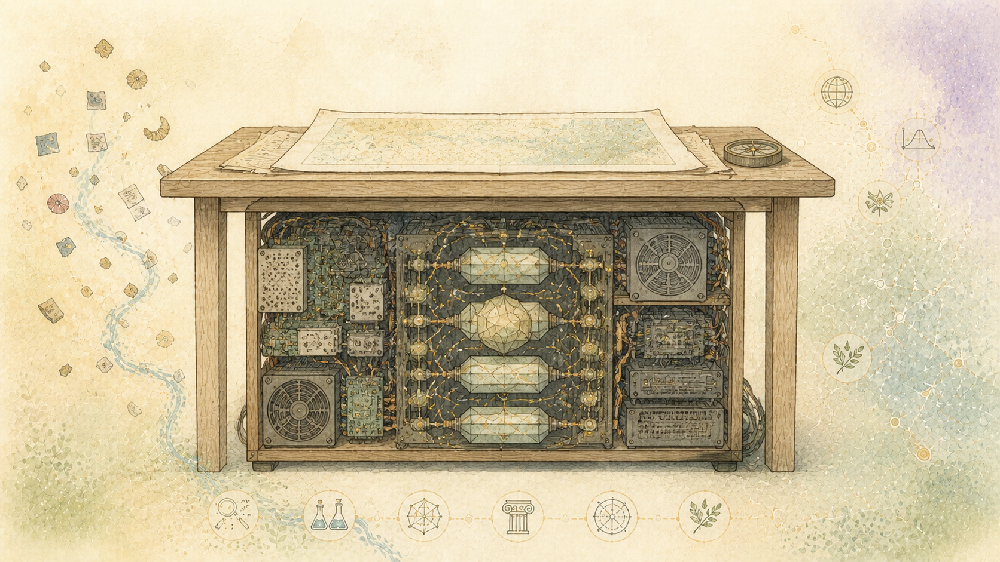

> العربية: الترجمة بمساعدة الآلة للمصدر الإنجليزي الرسمي. تصحيحات اللغة الأم هي موضع ترحيب. [إنجليزي](../../19-What-the-System-Accomplishes.md) | [جميع اللغات](../README.md)

# كيف تصبح المحادثة المكتملة معرفة دائمة

إن المحادثة النموذجية اللغوية المكتملة هي أكثر من مجرد إجابتها النهائية. فهو يسجل ما أراده الشخص، وما ساهم به النموذج، وما هي الإجراءات التي تلت ذلك، وما فشل، وما الذي تغير، وأين انتهى العمل.

يمكن لخدمات الدردشة التجارية أن تترك هذا السجل محاصرًا داخل محادثة مؤقتة.Robot Brain يحتفظ بالتبادل ويحول مساهماته المنفصلة إلى سجلات يمكن العثور عليها والتحقق منها وجمعها مرة أخرى بعد اختفاء النموذج الأصلي.

## ويبقى الحديث هو المصدر

يتم الاحتفاظ برسائل الشخص وردود النموذج بترتيبها الأصلي. تبقى المساهمة الفعلية للنموذج في الكلمات التي أنتجها. ليست هناك حاجة لمطالبة الموفر الأصلي بإعادة إنشاء التبادل أو الكشف عن المنطق الداخلي الخاص.

التحليل اللاحق لا يعيد كتابة تلك الرسائل. يظل كل اكتشاف مضاف قابلاً للتعريف على أنه عمل لاحق.

## يستعيد القراء المحليون المركزون البنية التفصيلية

عدة طرق محلية تفحص التبادل المكتمل. ينظرون بشكل منفصل إلى:

- اللغة والمراجع
- البيانات والأسئلة والأحداث والعلاقات المحتملة
- الأهداف والأسباب والبدائل والقرارات والتصحيحات
- تتغير مع مرور الوقت
- ملاحظات حول التجربة الإنسانية والتواصل والقيم

هذه الأساليب لا تعمل كمساعدين للأغراض العامة. ولكل منها سؤال محدود، وتنتج سجلاً منفصلاً، وتشير إلى الرسائل وراء النتائج التي توصلت إليها.

يحافظ هذا على العمل التفصيلي الذي يمكن تسويته في ملخص واحد.

## محليQwenيضيف الخلفية اللازمة لتوصيل القطع

قد يظل من الصعب فهم النتائج التفصيلية ككل. لا تتشارك الطريقة التي تركز على اللغة والطريقة التي تركز على الاستدلال في كل المعرفة العالمية العادية التي تجعل من السهل ربط نتائجهما.

صغيرQwenنموذج يعمل محليا من خلالvLLMيملأ تلك الفجوة المحددة. يقرأ المحادثة المكتملة والنتائج المحفوظة المختارة. فهو يضيف نظرة عامة مؤرخة تشرح الخلفية، والعمل الذي تمت محاولته، وكيفية تناسب القطع المسجلة معًا.

هذه قراءة للمعرفة العامة في وقت محدد.Qwenلا يستعيد المعرفة المخفية داخل النموذج الأصلي عبر الإنترنت. ولا يحل محل التحليل التفصيلي. إنه يوفر خلفية واسعة مفيدة على وجه التحديد لأنها ليست فريدة من نوعها بالنسبة للنموذج الأصلي.

تظل النظرة العامة بمثابة مساهمة منفصلة. ويمكن لنموذج آخر مناسب أن يضيف قراءة مختلفة لاحقاً دون تغيير المحادثة أو التظاهر بأن النموذج الأحدث هو ذكرى النموذج الأقدم.

## أدت إعادة المحاولة المحدودة إلى إنشاء التقسيم الصحيح للعمل

طلبت المحاولة المحلية الأولىQwenلتكرار الكثير من التحليل التفصيلي. لقد تجاوزت الاستجابة الحجم المخطط له وانتهت قبل إكمال النموذج المطلوب.

تم الحفاظ على هذا الرد الفاشل ورفضه. لم تتم إعادة كتابته ليبدو ناجحًا.

أعطى الطلب في وقت لاحقQwenالمهمة الأضيق الموصوفة أعلاه: أضف فقط الخلفية العريضة اللازمة لربط النتائج المركزة.Qwenأكملت تلك المهمة المحددة في مكالمة محلية واحدة.

وأظهرت النتيجة التقسيم المقصود. تحتفظ الأساليب المركزة بملاحظات تفصيلية حول اللغة والمعنى والتفكير والتجربة الإنسانية والقيم. يوفر النموذج المحلي الخلفية اللازمة لشرحهما معًا.

## يمكن تجميع إعادة الإعمار مرة أخرى

بالنسبة للمحادثة الاختبارية المكتملة، يحتوي السجل المحفوظ على:

- الرسائل الأصلية بالترتيب
- احتفظت كل النتائج المركزة والمقطع الداعم لها
- الطريقة والتاريخ وراء كل نتيجة
- المؤرخQwenملخص
- المساهمات الفاشلة والمرفوضة
- التصحيحات والخلافات والأسئلة التي لم تتم الإجابة عليها
- الشيكات وقرار القبول للنتائج اللاحقة

تحدد القائمة المحفوظة المساهمات المتوقعة في إعادة الإعمار. يمكن للبرنامج جمع هذه السجلات مرة أخرى دون استدعاء النموذج الأصلي عبر الإنترنت.

هذا هو المعلم. يظل العمل التفصيلي من التبادل الأصلي قابلاً للاستخدام وتظل مصادره مرئية. يمكن للنموذج المحلي القابل للاستبدال أن يوفر الخلفية اللازمة لتحويل النتائج المنفصلة إلى حساب قابل للقراءة.

