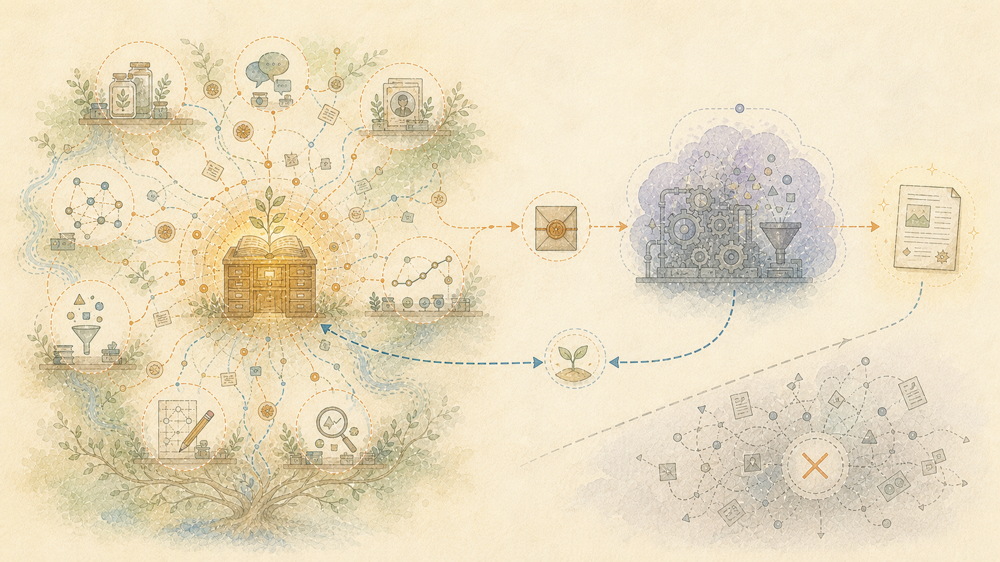

> Français: Traduction assistée par machine de la source anglaise faisant autorité. Native-language corrections are welcome. [Anglais](../../07-Privacy-and-Control-Stay-With-People.md) | [Toutes les langues](../README.md)

# Garder l'historique privé sous le contrôle de la personne

Un service de modèle linguistique devient plus utile lorsqu’il en sait plus sur une personne. Cela crée une forte incitation à envoyer au prestataire une part toujours plus grande du travail, des relations, des habitudes et de l'histoire d'une personne.

Le fournisseur contrôle le service. Il décide de la manière dont le modèle évolue, de la quantité d'informations antérieures qui restent disponibles, des règles qui s'appliquent et si le produit continue d'exister.

L'historique complet reste sur l'équipement contrôlé par la personne qui l'utilise. Un modèle en ligne peut recevoir le matériel nécessaire à une tâche approuvée. Cela n'a pas besoin du reste de la vie de la personne.

## Pourquoi cela protège aussi le sens

La formation sur modèle linguistique mélange les leçons de nombreuses œuvres humaines. Le modèle peut conserver des schémas utiles tout en perdant toutes les circonstances entourant chaque œuvre : qui l’a réalisée, pourquoi, pour qui, avec quelles preuves et ce qui s’est passé plus tard.

Appeler cette perte destructrice décrit ce qui ne peut pas être récupéré à partir du modèle formé. Il ne s’agit pas d’une accusation de vol et ne détermine pas si une utilisation particulière était licite. Les droits d'auteur, les autorisations, les contrats et autres questions juridiques dépendent des faits de chaque utilisation.

Conserver les dossiers d'une personne en dehors du modèle évite de répéter cette perte. Les mots originaux restent disponibles. Les interprétations ultérieures restent identifiables comme interprétations ultérieures.

## Moins d’informations quittent le dossier privé

Lorsqu’une aide extérieure est utile, le générateur de requêtes peut inclure uniquement les passages et instructions pertinents. Le service en ligne ne reçoit pas l'historique indépendant ni les méthodes locales utilisées pour préparer les demandes ultérieures.

Cela réduit l’exposition. Cela ne remplace pas la vérification des conditions actuelles du fournisseur, des pratiques de confidentialité, des règles de conservation ou de la loi.

## Le contrôle d’une personne s’arrête aux droits d’une autre personne

Les dossiers personnels mentionnent souvent d’autres personnes. Le maintien d’une conversation ou d’une observation ne donne pas la permission de la publier, de l’étudier dans un nouveau but, de la vendre ou de l’utiliser pour parler au nom de quelqu’un d’autre.

Le nom, les mots, l'image, le lieu, la routine, la santé, l'emploi, les croyances et les circonstances privées d'une autre personne peuvent toujours être protégés. Il en va de même pour les suppositions sur cette personne.

Quelque chose étant visible en ligne ne crée pas de consentement. La possibilité de le copier ne crée pas non plus de consentement.

## Séparez les intervenants et les revendications

Un enregistrement attestant que quelqu'un a fait une déclaration prouve seulement que la déclaration a été faite, lorsque la source soutient cet événement. Cela ne prouve pas que la déclaration était vraie ou que l'orateur est toujours d'accord avec elle.

Les mots humains, les citations, le texte généré par le modèle, les notes ultérieures, les corrections et les approbations sont conservés comme des éléments différents. Une page de chat ou un assistant n'obtient pas le droit de parler au nom d'une personne simplement parce qu'il a participé à l'échange.

## La diffusion publique est un travail distinct

La suppression de quelques noms ne garantit pas automatiquement la publication d'un dossier privé en toute sécurité. D'autres détails peuvent identifier quelqu'un lorsqu'ils sont combinés.

Une version publique nécessite sa propre révision pour :

- informations personnelles et d'identification
- les paroles et les droits des autres
- informations sur l'employeur et le client
- mots de passe, détails d'accès et emplacements privés
- licences et autorisations pour le matériel extérieur
- des allégations qui pourraient être confondues avec des accusations ou des conseils professionnels

L’approbation s’applique aux fichiers exacts examinés. Les analyses automatisées peuvent aider à détecter les risques, mais elles ne peuvent pas accorder d’autorisation ni remplacer les conseils juridiques lorsque cela est nécessaire.
