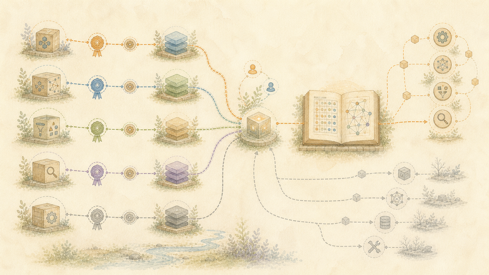

> Gaeilge: Aistriúchán meaisín-chuidithe ar an bhfoinse údarásach Béarla. Tá fáilte roimh cheartúcháin dhúchais. [Béarla](../../15-Why-a-Language-Model-Is-a-Replaceable-Tool.md) | [Gach teanga](../README.md)

# Úsáid múnla teanga don phost, ní mar chuimhne

Robot Brain nach samhail teanga le cuimhne bhreise é. Is iad na bogearraí coimeádta taifead, anailíse, cóimeála agus seiceála a chinneann cathain a chuideodh samhail teanga agus cén post teoranta a fhéadfaidh sé a dhéanamh.

Ní i gcónaí an tsamhail is cumhachtaí atá ar fáil ná an rogha is fearr don phost sin.

D’fhéadfadh múnla teanga íoctha a bheith ceart le haghaidh taighde nó scríbhneoireachta deacra. B’fhéidir gur leor múnla beag áitiúil mar mhíniú ar chúlra. Seans gur leor cuardach chun sliocht a aimsiú. Féadfaidh próiseas seasta a bheith níos sábháilte nuair a chaithfidh an freagra riail bheacht a leanúint. Uaireanta is é an freagra is fearr ná ceann a seiceáladh agus a shábháil cheana féin.

Déanann an tógálaí iarratais an rogha sin ó riachtanais an phoist. Féadfaidh sé múnla a úsáid, roinnt modhanna teoranta a chur le chéile, obair sheicte a athúsáid, nó gan aon ghlaoch ar mhúnla a dhéanamh. Sin é an fáth nach seachfhreastalaí é seo a chuireann iarratais ar aghaidh chuig seirbhís eile.

## Samhlacha íoctha ar líne

Chuidigh seirbhísí tráchtála samhail teanga le tógáil an tionscadail seo. Thacaigh siad le taighde, códú, scríbhneoireacht, agus athbhreithniú.

Chaill siad freisin treoracha níos luaithe, giorraíodh comhráite, rinne siad buille faoi thuairim ar chúiseanna, cuireadh freagraí gearra sa líonadh, agus thuairiscigh siad go raibh an obair críochnaithe sular sheiceáil siad é. Úsáideadh níos mó liúntais íoctha agus níos mó ama daonna chun na teipeanna sin a cheartú.

Ní leid dona é an teorainn níos doimhne. Ní féidir le samhail oilte stair iomlán na hoibre daonna a mhúin í a atógáil. Coinníonn sé patrúin agus cailleann sé naisc iontaofa le gach údar, cuspóir, lucht féachana, aighneas, ceartúchán agus dearcadh atá ar iarraidh.

Tá an t-eolas leathan sin úsáideach fós. Níor cheart go mbeadh sé mar an t-aon áit ina bhfuil stair duine.

Le hiarratas ar líne,Robot Brain taifid a dhéanamh ar an múnla a úsáideadh, cad a fuair sé, cad a thug sé ar ais, cén costas seirbhíse, cé na seiceálacha a rith, agus cibé ar coinníodh an toradh. Is é an cúlra gan tacaíocht fós moladh an mhúnla seachas fíric foinsithe.

## Níl an tsamhail áitiúil oilte ar an duine

Ritheann an suiteáil reatha beagQwenmúnla teanga trídvLLMar chrua-earraí áitiúla.Qwenis ranníocóir amháin is féidir a athsholáthar, ní an tionscadal féin.

Ní fhoghlaimíonn sé trí oiliúint ar chomhráite, obair nó saol an duine. Dhéanfadh oiliúint an stair sin a mheascadh ina mhúnla agus dhéanfaí an cosán ar ais go dtí na bunfhocail agus na himeachtaí a lagú.

Ina ionad sin,Qwenfaigheann sé/sí ábhar roghnaithe do jab amháin tar éis don chomhrá críochnú. Tá scrúdú déanta cheana féin ag modhanna áitiúla eile ar an teanga, ar ráitis, ar chaidrimh, ar réasúnaíocht, ar am, ar thaithí an duine, agus ar luachanna sa mhalartú.Qwencuireann sé leis an cúlra leathan nach bhfuil na modhanna a roinnt. Déanann sé seo níos éasca a mhíniú cad a tharla agus cén fáth.

Qwenní nochtann an cúntóir ar líne smaointe i bhfolach, oiliúint, nó réasúnaíocht phríobháideach. Tá ranníocaíocht úsáideach an chúntóra ar líne i láthair cheana féin sa chomhrá sábháilte. Níl eolas cúlra ginearálta uathúil don chúntóir sin, mar sin is féidir le múnla oiriúnach eile cabhrú leis na píosaí taifeadta a nascadh.

Tá anQwenSábháiltear an léamh leis an tsamhail ainm agus dáta. Fanann sé ar leithligh ón gcomhrá agus is féidir é a cheartú nó a athsholáthar ar ball. Ní gá don iarratas riamh na crua-earraí áitiúla a fhágáil.

## Ní míniú é cuardaigh

Is féidir le Cuardach sleachta le focail nó ábhair ghaolmhara a aimsiú. Ní féidir leis a chinneadh cén fáth a raibh tábhacht ag baint le heachtra, cé acu gníomh amháin ba chúis le gníomh eile, nó cad a bhí i gceist le duine éigin.

Teastaíonn fianaise, stair agus spás le ceartú ó na conclúidí sin.

## Áirítear ar chostas am an duine

Ní praghas agus luas na costais amháin. Éiríonn freagra saor costasach nuair a chaitheann duine uaireanta an chloig a aimsiú, an stair a mhíniú arís, agus an toradh a dheisiú.

Mar sin déanann tógálaí an iarratais breithniú ar tháillí seirbhíse, feithimh, athiarracht, úsáid fuinnimh agus seiceáil dhaonna. Féadfaidh múnla níos lú, modh seasta áitiúil, nó toradh sábháilte níos mó luach a chruthú nuair is fusa a chuid oibre a iniúchadh.

## Tá foinsí fós inaitheanta

Fanann taifid bhunaidh, téacs cóipeáilte, freagraí eiseamláireacha, taighde poiblí, athfhriotail, agus athbhreithnithe níos déanaí mar rudaí éagsúla.

Nuair is eol agus ceadaithe é, coimeádann an taifead an cruthaitheoir, an cuspóir, an lucht éisteachta, an dáta, an teanga, an fhianaise, easaontas, cearta, agus ceartúcháin níos déanaí. Ní thugann infhaighteacht phoiblí agus creidmheas leo féin cead chun ábhar cosanta a athdháileadh.

Cuimsíonn an stór seo doiciméadú poiblí agus léaráidí a cruthaíodh le tionscadail. Fágann sé taifid phríobháideacha, pasfhocail, sonraí rochtana, rúin an tsoláthraí, agus ábhar lasmuigh nach bhfuil imréitithe lena scaoileadh.
