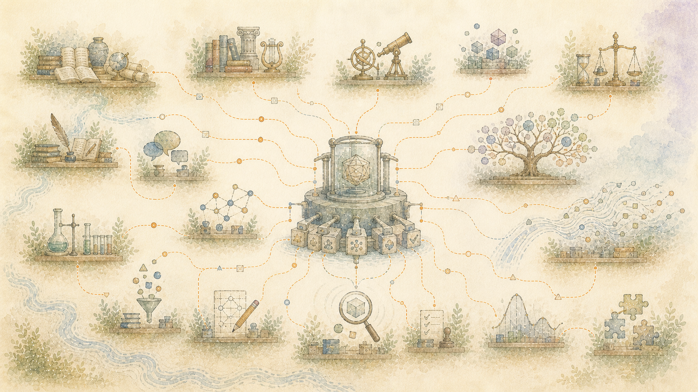

> Bahasa Indonesia: Terjemahan dengan bantuan mesin dari sumber bahasa Inggris resmi. Koreksi dalam bahasa asli dipersilakan. [Bahasa inggris](../../14-Sources-Behind-the-Design.md) | [Semua bahasa](../README.md)

# Penelitian di balik desain

Halaman ini diperuntukkan bagi pembaca yang menginginkan jejak penelitian. Penjelasan utama tidak memerlukannya.

Daftar tersebut mencakup ide-ide dan alat-alat yang digunakan, diuji, dibandingkan, ditolak, atau sekadar dipelajari. Hubungan-hubungan itu tidaklah sama. Mencantumkan sumber tidak berarti penulisnya berpartisipasi atau mendukung proyek tersebut.

## Menyimpan sumber dan perubahan seiring waktu

- Penelitian mengenai sejarah sumber dan perubahan informasi membentuk cara pencatatan menyimpan asal bahan, kapan bahan tersebut digunakan, dan apa yang kemudian menggantikannya.
- [Grafiti](https://github.com/getzep/graphiti)diperiksa sebagai salah satu pendekatan untuk mencatat koneksi yang berubah seiring waktu.
- Metode pencatatan perubahan yang sudah ada menginformasikan aturan bahwa ringkasan saat ini tidak boleh menggantikan sumber di baliknya.

Ide-ide ini membantu mempertahankan jalur yang seharusnya disembunyikan oleh jawaban model baru atau ringkasan yang ditulis ulang.

## Memisahkan klaim, dukungan, dan ketidaksepakatan

- [Teori Struktur Retoris Mann dan Thompson](https://aclanthology.org/J88-2003/)memberikan nama untuk hubungan antar bagian suatu dokumen, misalnya pokok bahasan dan penjelasannya.
- [Skema Argumentasi Walton, Reed, dan Macagno](https://www.cambridge.org/core/books/abs/argumentation-schemes/introduction/745B75B5933D17D86AC2E85971DA34A2)memberikan pertanyaan terfokus untuk memeriksa dukungan dan kesimpulan.
- [oAMF](https://github.com/arg-tech/oAMF)dan xAIF menyediakan pendekatan untuk mencatat klaim dan hubungannya.
- [Bank Prop](https://aclanthology.org/J05-1004/)mempengaruhi bagaimana pernyataan dan peran di dalamnya dicatat.
- [mantan pertama](https://aclanthology.org/2023.acl-long.306/)dan pekerjaan terkait diuji untuk menemukan struktur dokumen. Mereka tidak digunakan sebagai penilai akhir atas makna dan penalaran.

Sumber-sumber ini membantu mencegah satu paragraf yang sempurna menyembunyikan perbedaan antara suatu klaim, dukungannya, koreksi, dan ketidaksepakatan.

## Menemukan materi yang bermanfaat tanpa salah mengartikan kemiripan dengan kebenaran

- [Relevansi Marginal Maksimal Carbonell dan Goldstein](https://aclanthology.org/X98-1025/)cara-cara yang terinformasi untuk menyeimbangkan relevansi dengan pengulangan.
- [Lin dan Bilmes tentang peringkasan dokumen submodular](https://aclanthology.org/P11-1052/)cara yang terinformasi untuk memilih kelompok bagian yang berguna dalam batas ukuran.
- [Skor FAKTA](https://aclanthology.org/2023.emnlp-main.741/)pertanyaan yang terinformasi tentang bagaimana tepatnya klaim didukung.
- Penelitian tentang ringkasan yang dibangun dari rekaman tes informasi hubungan yang mempersingkat materi tanpa membuang koneksi yang penting.

Pencarian dan ringkasan dapat mengarahkan seseorang pada bukti. Mereka tidak dapat memutuskan mengapa sesuatu itu penting atau membuat suatu bagian menjadi kenyataan.

## Perencanaan sebelum menulis

- [Reiter dan Dale Membangun Sistem Pembuatan Bahasa Alami](https://www.cambridge.org/core/books/building-natural-language-generation-systems/0AE70C709A9BFBDC80B349B2D22A78CD)mempengaruhi pemisahan pemilihan isi, perencanaan, dan penulisan kalimat.
- [NLG Langkah demi Langkah](https://aclanthology.org/N19-1236/)Dan[perencanaan makro data-ke-teks](https://aclanthology.org/D19-1318/)perbandingan informasi metode perencanaan dokumen.
- [SederhanaNLG](https://github.com/simplenlg/simplenlg),[Kerangka Tata Bahasa](https://www.grammaticalframework.org/), Dan[BukaCCG](https://github.com/OpenCCG/openccg)dievaluasi sebagai cara untuk mengubah konten yang direncanakan menjadi kalimat.
- Penelitian terhadap informasi yang diketahui dan baru, hubungan antar kalimat, jenis komunikasi, dan bentuk dokumen memengaruhi cara penjelasan diurutkan untuk pembaca yang berbeda.

Secara bersama-sama, pekerjaan ini mendukung perencanaan dokumen sebelum meminta model bahasa untuk menulisnya.

## Pemahaman manusia dan biaya membaca

- Penelitian tentang bagaimana orang membangun pemahaman dan mengelola upaya mental memberikan batasan pada panjangnya, konsep baru, dan pengulangan.
- [Coh-Metriks](https://www.cambridge.org/core/books/automated-evaluation-of-text-and-discourse-with-cohmetrix/AE4A1D5DCCBA1AE3A9632E9D4D380270),[TAACO](https://www.linguisticanalysistools.org/taaco.html),[Lingkup Dokumen](https://docuscope.github.io/), TextDescriptives, dan LFTK dievaluasi sebagai cara untuk membandingkan tulisan.
- Teori Penentuan Nasib Sendiri, penelitian tentang makna hidup, dan penelitian tentang nilai memberikan pertanyaan terbatas tentang makna pribadi. Mereka tidak mendukung diagnosis otomatis atau profil orang secara luas.

## Alat pengeditan terbatas

[penanda laser](https://github.com/google-research/lasertagger),[GECToR](https://github.com/grammarly/gector), Dan[SuntingT5](https://aclanthology.org/2022.findings-acl.260/)dievaluasi untuk tugas pengeditan yang membatasi seberapa banyak kata-kata baru yang boleh diperkenalkan.

## Hak dan catatan yang lebih lengkap

Dokumentasi ini tidak mencakup salinan buku, makalah, program, file model terlatih, atau koleksi penelitian yang diberi nama.[Sumber, lisensi, dan privasi](../../SOURCES-LICENSES-AND-PRIVACY.md)mencatat tinjauan lisensi untuk program dan file terlatih yang benar-benar digunakan atau diuji.

Catatan penelitian swasta berisi lebih banyak makalah, standar publik, alat, koleksi, karya budaya, pendekatan yang ditolak, dan hasil tes. Penghargaan publik dapat tumbuh ketika catatan-catatan tersebut diperiksa, termasuk ide-ide yang membantu terutama dengan menunjukkan apa yang tidak berhasil.
