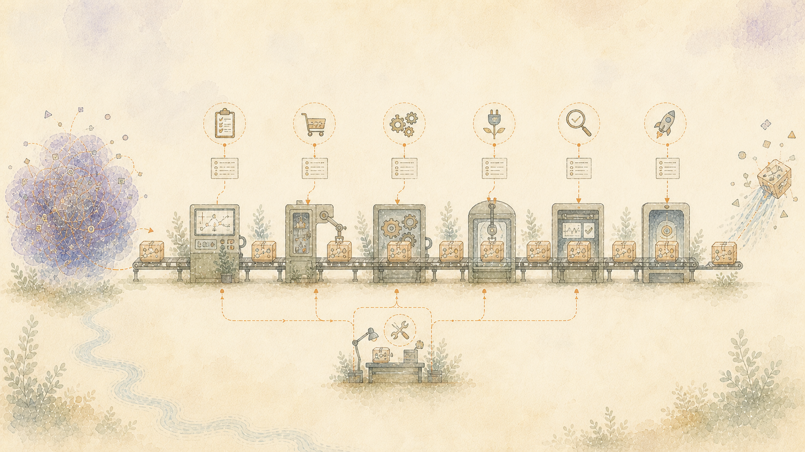

> Português: Tradução assistida por máquina da fonte oficial em inglês. Correções no idioma nativo são bem-vindas. [Inglês](../../05-How-Evidence-Becomes-a-Finished-Document.md) | [Todos os idiomas](../README.md)

# Construa o documento antes de escrever a prosa

Fornecer uma solicitação a um modelo de linguagem e uma pilha de arquivos geralmente produz um documento que parece concluído antes de ser sólido. Evidências importantes podem estar faltando. O mesmo ponto pode aparecer em diversas seções. O preenchimento suave pode ocultar a frase que o leitor precisava.

Robot Brain planeja o resultado antes de pedir a um modelo de linguagem ou outro método de escrita que o esboce.

## Comece com o leitor e o propósito

Um guia de manutenção, uma explicação pública, um resumo da pesquisa e uma história pessoal são trabalhos diferentes. Antes de coletar material, a solicitação identifica:

- quem vai ler o documento
- o que eles precisam disso
- que perguntas ele deve responder
- quais evidências são necessárias
- quanto detalhe é razoável

## Encontre as evidências que cada seção precisa

O plano funciona de trás para frente a partir dessas questões. Procura eventos, reivindicações, decisões, tentativas fracassadas, correções e questões abertas necessárias para respondê-los.

Cada descoberta aponta para sua fonte. Se os leitores disponíveis não puderem apoiar uma resposta, o plano deixa a questão em aberto.

## Faça um plano para todo o documento

Tentativas anteriores recuperaram passagens com redação semelhante e trataram a pilha como uma explicação. Outras tentativas solicitaram que um modelo de linguagem escrevesse seções separadamente. O resultado se repetiu, mudou termos entre seções e inventou conexões que não estavam nas evidências.

Um plano de documento completo torna esses problemas visíveis antes de a prosa ser escrita. Também decide o que pode ser deixado de fora sem divulgar a história.

## Escreva apenas o que a evidência pode conter

A fase de escrita ordena o material, explica termos desconhecidos e conecta as seções para o leitor pretendido.

Um modelo de linguagem pode ajudar na redação. Não pode acrescentar um facto, motivo ou nível de certeza que as fontes não apoiem. Um rascunho mais suave não é uma melhoria se se tornar menos preciso ou demorar mais para ser lido.

## Confira o documento completo

A revisão final pergunta se o documento responde às perguntas exigidas, usa suas fontes honestamente, mantém visíveis incertezas importantes e se ajusta ao tempo disponível do leitor.

O que é aceito é o documento final exato que passou nessas verificações. Uma coleção de parágrafos individualmente bem-sucedidos não é suficiente.
