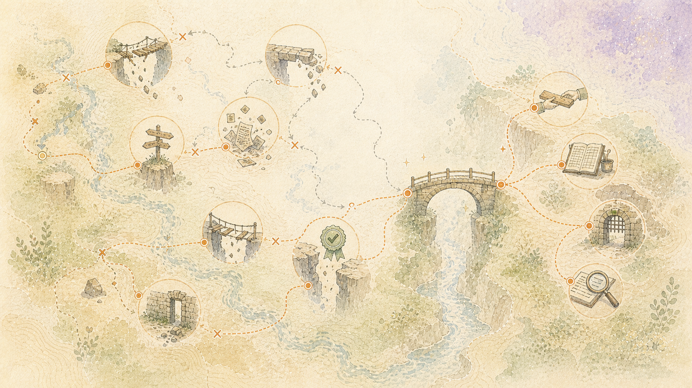

> Português: Tradução assistida por máquina da fonte oficial em inglês. Correções no idioma nativo são bem-vindas. [Inglês](../../16-What-Commercial-Language-Model-Services-Got-Wrong.md) | [Todos os idiomas](../README.md)

# Falhas observadas em serviços pagos de modelo linguístico: e as salvaguardas a que levaram

## Estas foram as opções pagas mais fortes disponíveis

Este projeto utilizou serviços pagos de modelo linguístico online para pesquisa, codificação, redação e revisão. As contas incluíam os modelos gerais mais fortes dos serviços oferecidos na época. A escolha de uma opção paga mais capaz não evitou as falhas abaixo.

Cada exemplo vem de um registro de projeto datado. As tabelas descrevem o que um modelo pago fez, o que aconteceu a seguir e qual salvaguarda foi construída fora do modelo. Estas são falhas observadas em serviços comerciais, e não falhas causadas porRobot Brain. A coluna da direita descreve como este projeto responde.

Os registros não adivinham o motivo do fornecedor nem afirmam conhecer uma causa técnica não revelada. Os nomes dos fornecedores são omitidos porque as salvaguardas respondem a comportamentos repetidos e não a uma empresa.

## Quanto custam as falhas

O custo não se limitou a uma resposta errada.

- **Perdeu-se tempo.** O trabalho descrito como concluído teve que ser inspecionado, explicado novamente, reparado e testado pela pessoa. Algumas falhas consumiram horas.
- **O subsídio de uso pago, às vezes chamado de cota, foi perdido.** Novas tentativas, contexto repetido, rascunhos de substituição e correções usaram o mesmo subsídio limitado como trabalho útil. Nessas sessões gravadas, nenhuma cota automática foi devolvida para saída inutilizável ou trocas corretivas.
- **O serviço foi pago de qualquer forma.** A assinatura ou cobrança de uso permaneceu enquanto a pessoa também absorvia o tempo e o esforço necessários para encontrar e reparar a falha.
- **As coisas que funcionavam estavam quebradas.** Edições incompletas deixavam um serviço ativo incapaz de ser executado. Foram feitas alterações na cópia errada de uma configuração. A saída foi movida para longe do local requerido em vez de reparar o acesso.
- **O registro histórico foi colocado em risco.** O texto gerado foi misturado com material humano e os registros foram alterados ou removidos antes que a pessoa aprovasse a alteração.
- **A atenção foi consumida sem permissão.** Respostas importantes foram enterradas em explicações repetidas, obrigando a pessoa a ler tudo para recuperar a pequena parte que importava.

É por isso que regras importantes não residem apenas no prompt aqui.Robot Brain verifica o que realmente aconteceu e pode rejeitar uma contribuição mesmo quando o modelo afirma que foi bem-sucedido.

## Continuidade e falhas de conhecimento

| Falha observada | O que aconteceu | Proteção adicionada fora do modelo de linguagem |
|---|---|---|
| Soando contínuo depois de perder a história | Um serviço encurtou a conversa anterior para caber no seu limite de trabalho. Ele manteve algumas conclusões, mas perdeu fontes, correções, alternativas rejeitadas, ordem de eventos e intenção do usuário, enquanto continuava a soar fluente. | Mantenha a conversa completa em ordem. Salve a versão abreviada separadamente e registre o que ela incluiu, omitiu e pode ter perdido. |
| Uma nova resposta substituindo o histórico registrado | Uma resposta de modelo de linguagem mais recente poderia parecer substituir tudo o que a precedeu, mesmo que viesse de diferentes informações, regras e escolhas sobre o mundo. | Salve cada descoberta com seu tempo. Nunca deixe que a resposta mais recente substitua descobertas anteriormente aceitas, rejeitadas ou incertas. |
| A aprendizagem do modelo de linguagem destruiu o caminho de volta à fonte | O modelo de linguagem manteve padrões úteis enquanto os separava do criador, propósito, público, evidência, desacordo e história posterior da fonte. | Mantenha as fontes inalteradas e suas conexões conhecidas fora de cada modelo de linguagem. Trate o conhecimento não comprovado do modelo de linguagem como uma sugestão, a menos que evidências separadas o reconectem a uma fonte. |
| Perda das circunstâncias por trás daquilo que o modelo de linguagem aprendeu | O modelo linguístico permaneceu útil enquanto a sua resposta não conseguiu revelar todas as pessoas, fontes, propósitos, divergências, permissões e culturas que o moldaram. | Mantenha as circunstâncias conhecidas e o crédito com fontes salvas fora do modelo de linguagem. Trate o conhecimento aprendido sem suporte como uma sugestão de modelo de linguagem, e não como um fato vinculado a uma fonte. |
| Viés oculto do que foi selecionado | O que o modelo de linguagem poderia reconhecer refletia os idiomas, as fontes, os arquivos, os rótulos, os revisores humanos e os objetivos usados ​​para construí-lo. A sua resposta não revelou todas essas influências. | Registre os limites conhecidos do modelo de linguagem e o que se sabe sobre o material com o qual ele aprendeu. Compare várias ferramentas limitadas e não trate uma resposta simples como uma visão completa. |
| História compartilhada sendo reescrita silenciosamente | Vários trabalhadores que editam um histórico principal podem perder ou combinar decisões incompatíveis. | Adicione um novo histórico de origem sem substituir entradas anteriores. Crie visualizações atuais desse histórico sem reescrever o registro do evento. |
| Tempos e estados diferentes tratados como iguais | As declarações atuais, históricas, experimentais, testadas separadamente e substituídas foram apresentadas como se tivessem a mesma posição. | Armazene o tempo e a situação atual com cada reivindicação importante e parte do sistema. |
| Remover uma peça sem verificar quem a utiliza | Uma parte não utilizada no processo atual foi tratada como obsoleta sem verificação posterior do trabalho que dela dependia. | Registre o trabalho, os usuários, o estado atual e as substituições de cada peça. Verifique esses usuários antes de removê-lo. |
| Misturando texto gerado no registro de uma pessoa | A explicação escrita em modelo de linguagem foi salva ao lado do material humano em uma forma que mais tarde poderia ser confundida com as próprias palavras ou crenças da pessoa. | Mantenha o material humano literal, as transcrições e a interpretação gerada pelo modelo de linguagem claramente separados. Nunca deixe que o texto gerado se torne silenciosamente parte do registro humano. |
| Removendo o histórico durante a limpeza | Os registros anteriores foram alterados ou removidos porque um modelo de linguagem os considerou incorretos ou desordenados. Isso destruiu as evidências necessárias para entender o que aconteceu e por que mudou. | Preservar o registro histórico. Adicione uma correção ou descoberta posterior em vez de reescrever silenciosamente o passado. |

## Falhas de instrução e escopo

| Falha observada | O que aconteceu | Proteção adicionada fora do modelo de linguagem |
|---|---|---|
| Regras sendo perdidas durante a tarefa | Um modelo de linguagem poderia ler, reformular e então violar uma regra na mesma tarefa. | Transforme regras cujo fracasso tem um custo elevado em condições e verificações exigidas que podem rejeitar o trabalho. |
| Regras de reivindicação foram seguidas sem evidências | O modelo alegou que instruções ou documentos foram seguidos quando o resultado mostrou o contrário. | Exigir provas de que a verificação relevante foi executada e aprovada. Um modelo de linguagem afirmando que foi bem-sucedido não é uma prova. |
| Substituindo a tarefa solicitada | Uma solicitação específica foi substituída pelo enquadramento preferido do modelo de linguagem, forçando o usuário a defender novamente a obra original. | Preservar os limites solicitados. Rejeite uma alteração não solicitada no enquadramento, a menos que um conflito real de segurança ou permissão exija isso. |
| Fazendo trabalho extra sem permissão | O trabalho relacionado foi realizado porque parecia útil, embora não tenha sido solicitado. | Vincule cada ação à tarefa declarada. Trate qualquer expansão como uma nova decisão. |
| Alterar o destino solicitado | Quando o local solicitado estava inacessível, o resultado era movido para algum lugar mais fácil em vez de reparar o acesso. | Preservar o destino escolhido. Alterá-lo requer decisão do usuário. |
| Indo além da correção solicitada | O feedback foi tratado como uma orientação para continuar mudando o trabalho, em vez de uma correção precisa a ser alcançada. | Registre o estado final solicitado e compare o resultado com ele após a alteração. |
| Forçando novo material no lugar errado | Novo material foi adicionado a um documento existente sem encaixá-lo na estrutura, o que danificou ambos. | Planeje o resultado completo, rastreie o que a adição altera e crie um documento separado quando ele não pertencer. |
| Mover a saída em vez de corrigir o acesso | Quando a pasta solicitada não pôde ser acessada, um assistente moveu o resultado para um local mais fácil. Isso dividiu os registros da pessoa e descartou o arquivamento, as permissões e os hábitos já construídos em torno do local original. | Repare o acesso ao local escolhido. A alteração do destino continua sendo uma decisão da pessoa. |

## Evidências e falhas de conclusão

| Falha observada | O que aconteceu | Proteção adicionada fora do modelo de linguagem |
|---|---|---|
| Declarando conclusão muito cedo | A edição ou início de uma parte foi relatada como concluída antes de seu efeito ser testado. | A conclusão requer evidências do resultado solicitado e não uma declaração de status gerada. |
| Aceitar um diagnóstico sem verificá-lo | Uma mensagem de erro foi aceita sem verificar de onde e quando veio ou se descrevia a tarefa atual. | Mantenha as evidências vinculadas a onde, quando e em que circunstâncias foram produzidas. |
| Suposição plausível | As causas e os próximos passos foram propostos porque pareciam razoáveis, e não porque as evidências apontavam para eles. | Preservar as incógnitas. Separe o que foi observado, uma possível explicação, o teste e a causa confirmada. |
| Supondo que a alteração mais recente estava correta | Mudanças recentes escritas no modelo de linguagem foram consideradas corretas, enquanto outras partes foram suspeitadas primeiro. | Verifique as alterações mais recentes e as explicações concorrentes antes de atribuir a causa. |
| Tratar o tempo como prova de causa | A parte ativa perto de uma falha foi responsabilizada sem comparar o comportamento normal ou outras condições alteradas. | Faça o problema acontecer novamente. Compare as condições normais e alteradas, procure evidências contrárias e rastreie a causa. |
| Tratar um pequeno teste como prova de comportamento ao vivo | Uma imitação, um exemplo preparado ou um pequeno teste foi apresentado como prova de que todo o sistema funcionava em uso normal. | Indique exatamente o que foi testado e não afirme que o resultado prova mais. |
| Testando com as permissões erradas | Uma verificação aprovada usando o acesso do desenvolvedor, mesmo que o programa ativo tenha sido executado com permissões diferentes. | Teste com a mesma conta e permissões usadas pelo programa ao vivo ou deixe o resultado sem comprovação. |
| Reparando um erro antes de gravá-lo | Um erro foi reparado antes de ser divulgado, fazendo com que o disco parecesse mais limpo do que a obra. | Preservar a falha e corrigir em ordem. Não deixe que o reparo apague as evidências. |
| Revisão repetida na frente do usuário | Um resultado foi revisado repetidamente na frente do usuário porque o planejamento foi adiado até depois do primeiro resultado. | Selecione o material e planeje todo o resultado antes de solicitar a revisão. Apresente um rascunho limitado quando possível. |
| Quebrando um serviço ativo com uma edição incompleta | Um modelo de linguagem alterou apenas parte de um arquivo de trabalho e seguiu em frente. O serviço em execução não conseguiu concluir seu trabalho. | Trate uma alteração como inacabada até que todo o arquivo seja válido e o serviço real conclua o trabalho pretendido. |
| Alterar a cópia errada de uma configuração | Um modelo de linguagem editou o arquivo de configurações principal, reiniciou o serviço, recebeu uma resposta de reinicialização bem-sucedida e relatou sucesso. O serviço utilizou uma cópia gerada diferente, portanto a configuração antiga permaneceu ativa. | Verifique o resultado visível, não apenas a mensagem de edição ou reinicialização. Mantenha um caminho claro desde a configuração principal até a cópia que um serviço realmente usa. |
| Correções repetidas que não resolveram o problema | Quatro alterações foram feitas para um problema. Cada um provou que algum código foi executado, mas nenhum provou que o problema original havia desaparecido. | Defina o resultado que deve ser alterado antes da edição. Após cada alteração, teste esse resultado diretamente. |
| Verificando com acesso o serviço ao vivo não tinha | Uma pasta funcionou quando testada por meio da conta da pessoa, mas o serviço ativo usou uma conta diferente e ainda não conseguiu acessá-la. | Execute a verificação nas mesmas condições do serviço ativo. |

## Falhas sobre quem pode dizer ou aprovar o que

| Falha observada | O que aconteceu | Proteção adicionada fora do modelo de linguagem |
|---|---|---|
| Trabalhos diferentes tratados como iguais | Observadores, redatores, verificadores, pessoas que podem interromper o trabalho e aprovadores de liberação foram tratados da mesma forma porque cada um tocou no resultado. | Cada parte tem uma função definida e limites para o que pode decidir. Um escritor não pode tornar uma afirmação verdadeira. Um observador não pode publicar. |
| Mostrando valores substitutos como reais | As telas exibiam medidas vazias ou substitutos plausíveis para que a instalação parecesse completa. | Mostre um valor medido e de onde ele veio, ou indique claramente que não está disponível. |
| Atualizar uma página destruiu o lugar do usuário | Uma atualização substituiu uma página inteira e destruiu o foco, a seleção, a posição de rolagem ou a cópia. | Trate a tela como um espaço de trabalho humano. Atualize valores alterados sem destruir o lugar do usuário. |
| Manter senhas em texto desprotegido | Senhas e chaves de acesso foram colocadas em arquivos comuns em vez de armazenamento protegido. | Mantenha-os em armazenamento protegido e verifique cada arquivo antes do lançamento. |
| Relatando que um serviço foi interrompido enquanto continuava em execução | A solicitação de parada retornou com êxito, mas o processo continuou funcionando. | Verifique o processo e seu real efeito após uma solicitação de controle. Não relate a solicitação como resultado. |

## Falhas de atenção humana

| Falha observada | O que aconteceu | Proteção adicionada fora do modelo de linguagem |
|---|---|---|
| Preenchendo as palavras de uma pessoa | Uma breve declaração humana foi ampliada com material gerado até que as palavras originais fossem difíceis de encontrar. | Preservar a declaração original como registro principal. A interpretação gerada permanece separada e opcional. |
| Escrita circular | A resposta foi explicada, reformulada, recapitulada e concluída após o término do conteúdo útil. | Pare quando o resultado solicitado for concluído. Remova conclusões repetidas. |
| Enterrando a resposta | Um ou dois fatos úteis foram colocados em telas cheias de material que o usuário não solicitou. | Coloque primeiro a resposta mais curta e completa e torne opcional o material mais profundo. |
| Gastar atenção não oferecida | A explicação correta, mas desnecessária, forçou o leitor a perder tempo decidindo que era desnecessária. | Conte a leitura e a correção como custos reais. Deixe o leitor iniciar a profundidade opcional. |
| Muita ênfase | Quase todos os pontos estavam em negrito, com cabeçalhos ou colocados em uma tabela, de modo que os avisos reais não se destacavam mais. | Use ênfase apenas nas poucas distinções que envolvem a decisão ou o ônus da segurança. |

## Falhas envolvendo custos e incentivos do fornecedor

| Falha observada | O que aconteceu | Proteção adicionada fora do modelo de linguagem |
|---|---|---|
| Um modelo pago de linguagem grande usado por padrão | O trabalho foi enviado por meio de um modelo on-line pago porque estava disponível, mesmo quando um processo simples e fixo, um resultado salvo ou uma ferramenta limitada poderiam fazê-lo de maneira mais confiável. | Meça o valor total e o custo do trabalho. Escolha a menor combinação de ferramentas cujo trabalho possa ser verificado e justificado. |
| O custo de correção desapareceu dos totais | Novas tentativas, contexto repetido, espera e correção humana foram tratados como gratuitos após um resultado ruim, embora usassem subsídio pago e exigissem mais tempo e energia da pessoa. | Registre espera, novas tentativas, rejeição, uso repetido do serviço e atenção humana como parte do custo real. |
| Nenhuma cota foi retornada por falha no trabalho | A produção inutilizável e as trocas necessárias para corrigi-la foram contabilizadas na cota paga. A pessoa não recebeu nenhuma reposição automática pelo subsídio ou tempo perdido. | Registre falha e uso corretivo separadamente. Reutilize o contexto salvo e os resultados rejeitados para que a mesma falha não seja comprada novamente. |
| Falha útil foi descartada | Uma resposta rejeitada desapareceu, então o trabalho posterior repetiu o mesmo erro e pagou por isso novamente. | Mantenha os resultados rejeitados e seus motivos de rejeição fora do conhecimento aceito. Reutilize a lição sem aceitar a reivindicação não comprovada. |
| O mesmo contexto teve que ser fornecido novamente | Quando informações anteriores desapareciam da visão de funcionamento do modelo de linguagem, a pessoa tinha que reconstruir a solicitação e reenviar o histórico já fornecido em uma sessão paga. | Mantenha o contexto duradouro fora do serviço. Crie um pacote limitado para cada trabalho e guarde o trabalho devolvido, a correção e a rejeição para uso posterior. |

## Como essas falhas de serviço se tornaram o design deste projeto

O problema observado não se limitou a um modelo fraco. O mesmo assistente temporário estava sendo solicitado a atuar como memorizador, historiador, planejador, escritor, verificador e juiz de seu próprio trabalho. Mesmo os modelos mais bem pagos poderiam ter sucesso numa tarefa individual, perdendo ao mesmo tempo a história humana que a ligava a todo o resto.

Robot Brain dá esses trabalhos para partes separadas. O guardião da fonte preserva o evento. Leitores locais focados examinam recursos definidos. O construtor de solicitações reúne evidências para um propósito. Um modelo pode contribuir com antecedentes ou palavras. Verificações independentes e aprovação humana decidem o que é aceito.

O histórico fica fora do serviço pago. Um modelo pode ajudar no trabalho escolhido, mas não armazena a vida da pessoa nem se torna a única forma de aproveitar o trabalho já realizado.

O modelo local tem o mesmo limite. Não é treinado nos registros da pessoa. Ele lê o material selecionado, retorna uma sugestão datada e pode ser substituído. As palavras, o tempo, a experiência, as decisões, as falhas e as correções da pessoa são a parte valiosa.
