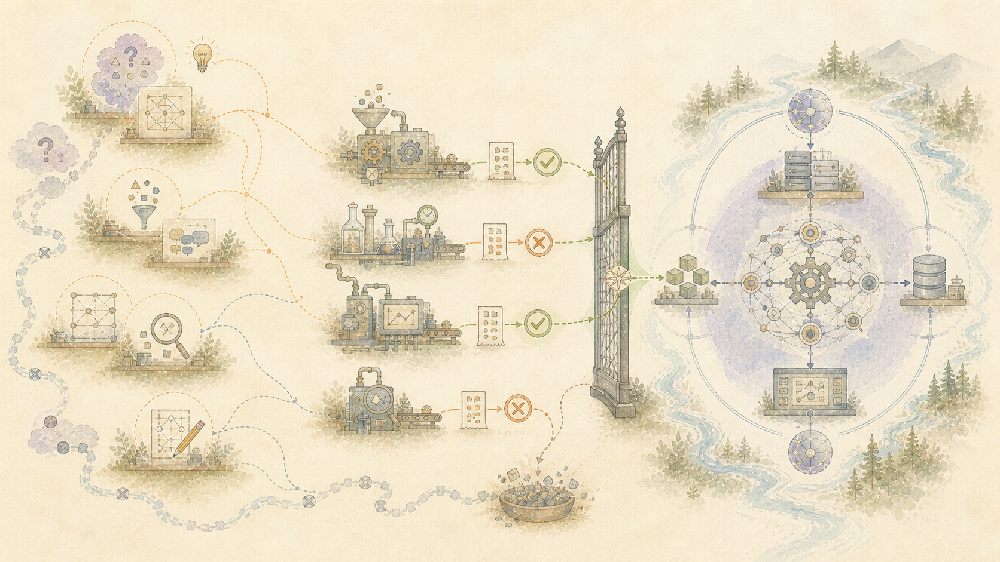

> Română: Traducere asistată automat a sursei autorizate în limba engleză. Corecțiile în limba maternă sunt binevenite. [engleză](../../08-What-Works-Today.md) | [Toate limbile](../README.md)

# Ce face implementarea actuală

Robot Brain rulează software pentru păstrarea și reconstruirea sensului în jurul lucrării înregistrate. Nu este o propunere pentru un chatbot, iar implementarea sa actuală nu este un model lingvistic.

## Capabilități în implementarea actuală

Execuțiile înregistrate arată că software-ul poate:

- păstrați o conversație finalizată fără a o înlocui cu un rezumat
- păstrați cuvintele persoanei separate de răspunsurile model și de interpretarea ulterioară
- creați descoperiri detaliate despre limbaj, sens, raționament, timp, experiență umană și valori
- conectați fiecare descoperire reținută la partea conversației din spatele acesteia
- păstrați corecțiile, dezacordurile, munca eșuată și întrebările fără răspuns
- adăugați o prezentare generală datată a cunoștințelor generale locale fără a apela modelul online original
- adună contribuțiile reținute pentru o reconstrucție solicitată
- înregistrați ceea ce a fost verificat, respins, corectat și acceptat
- înlocuiți un ecran sau un model de limbă participant fără a înlocui istoricul salvat

Acestea sunt funcții ale software-ului din jurul modelelor. Nu sunt abilități revendicateQwen,LibreChat, sau un asistent online.

## Ce s-a întâmplat în etapa finală a conversației

Conversația testată a fost salvată cu mesajele persoanei și răspunsurile modelului online în ordine.

Metodele locale concentrate au produs apoi înregistrări separate despre schimb. Munca lor a acoperit limbajul și sensul, raționamentul, observațiile psihologice, observațiile filozofice, relațiile și schimbările în timp. Fiecare contribuție reținută a rămas legată de materialul sursă și de metoda care a produs-o.

Aceste metode detaliate nu prezintă în mod intenționat cunoștințele generale de bază ale unui model de uz general. Un mic localnicQwenmodel, deservit devLLM, a citit materialul selectat și a adăugat o prezentare generală datată. Sarcina sa a fost să furnizeze un context obișnuit care a conectat constatările separate și a făcut schimbul de înțeles în ansamblu.

Qwennu a recuperat gândurile ascunse ale modelului original, istoricul antrenamentului sau starea internă privată. Contribuția utilă a modelului original era deja prezentă în mesajele salvate. Cunoștințe generale ample au fost furnizate de un model local înlocuibil, deoarece aceste cunoștințe nu erau unice pentru furnizorul inițial.

## Ce înseamnă „complet” pentru această etapă

Cuvântul se referă la lista menținută de contribuții pentru această cursă. Fiecare mesaj sursă și fiecare contribuție pe care procesul a reținut pentru reconstrucție poate fi găsită și adunată din nou.

Nu înseamnă că un model a oferit o interpretare completă. Realizarea este că piesele acceptate sunt păstrate, separate după sursă și metodă și disponibile pentru reconstrucție fără a relua schimbul online original.

## Cum este susținută cererea

Executarea înregistrează ce părți au fost executate, ce a primit fiecare, ce a returnat fiecare, ce contribuții au fost respinse și ce verificări au trecut. Reconstrucția este măsurată pe baza propriei liste salvate de înregistrări așteptate.

Un test de componentă este descris ca un test de componentă. O rulare conectată este descrisă ca o rulare conectată. Munca planificată rămâne separată de implementarea actuală.

Următoarea activitate include testare independentă mai amplă, suport pentru mai multe tipuri de înregistrări, mai multe limbi și culturi, ecrane de revizuire mai clare și o măsurare mai bună a timpului pe care oamenii îl petrec citind și corectând rezultatele.
