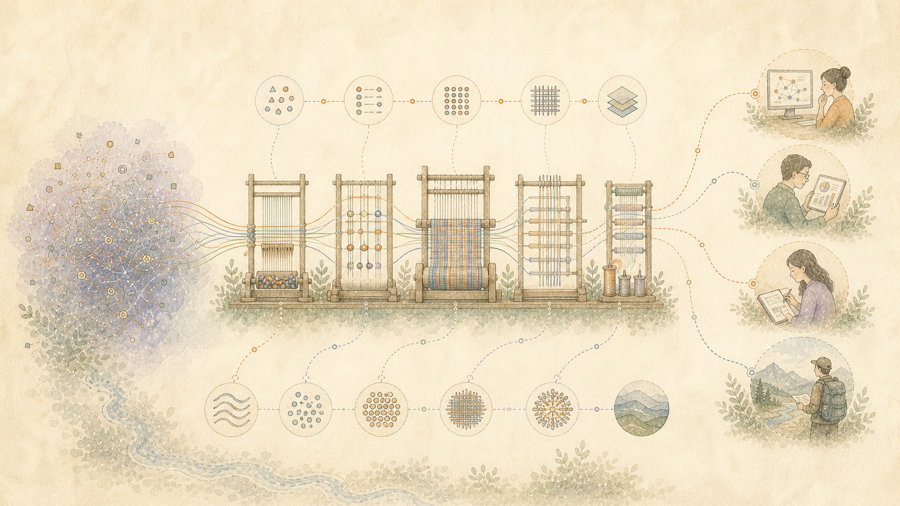

> Українська: Машинний переклад авторитетного англійського джерела. Виправлення рідною мовою вітаються. [англійська](../../06-One-Meaning-Different-Readers.md) | [Всі мови](../README.md)

# Поясніть одну і ту ж істину різним читачам

Твердження може бути точним і все одно бути марним для того, хто його читає. Відповідь може надійти надто пізно, використовувати незнайому мову або поховати один корисний факт під сторінками пояснень.

Ця робота розділяє два рішення:

1. Що підтверджують докази?
2. Який найчіткіший спосіб пояснити це цьому читачеві?

Зміна пояснення не повинна змінювати докази.

## Запитуйте, а не гадайте

Для конкретного обміну читач може вибрати коротку відповідь, докладне пояснення, текст, аудіо чи іншу доступну форму. Вони можуть запитати більше деталей, виправити непорозуміння або зупинитися.

Цей вибір стосується обміну. Це не дозволяє створювати постійний профіль особистості або вгадувати чийсь приватний психічний стан.

## Презентація не є правдою

Після того, як підтверджені твердження будуть зрозумілі, текст може змінити порядок, приклади, рівень деталізації та пояснення незнайомих термінів.

Він не може перетворити можливу інтерпретацію на факт. Він не може усунути помилку, яка потрібна читачеві для розуміння результату. Це не може додати впевненості заради того, щоб здатися корисним.

## Час на читання: це реальна ціна

Платні помічники, які використовувалися під час розробки, часто видавали набагато більше тексту, ніж потрібно. Вони повторювали моменти, розширювали короткі заяви та наголошували майже на всьому. Потім людина мала пошукати відповідь, виправити її та знову пояснити запит.

Цей час має таке ж значення, як і плата за послуги та обчислювальний час. Більше слів не є більш корисним, якщо вони ускладнюють пошук відповіді.

Гарна відповідь веде до корисного результату. Він дає пояснення, необхідні для розуміння та використання цього результату. Додаткова глибина залишається доступною, коли її просить читач.

## Що ще потребує перевірки

Поточне програмне забезпечення може встановлювати вимоги до довжини, доказів і готової форми. У майбутніх тестах потрібно буде порівняти, наскільки добре те саме підтримуване значення зберігається в різних читачах, мовах, культурах і потребах у доступності.

Люди, які отримують пояснення, повинні мати можливість виправити його. Їхнє виправлення стає частиною запису, а не прихованим уподобанням, яке вгадала модель.
