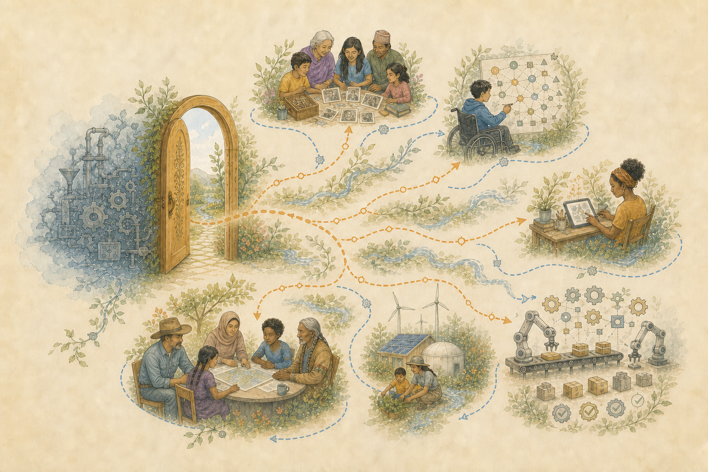

> اردو: مستند انگریزی ماخذ کا مشین کی مدد سے ترجمہ۔ مادری زبان کی تصحیحیں خوش آئند ہیں۔ [انگریزی](../../README.md) | [تمام زبانیں۔](../README.md)

# ریکارڈ رکھیں۔ ماڈل کو تبدیل کریں۔

Robot Brain طویل عرصے سے چلنے والے انسانی کام کے پیچھے تاریخ اور معنی کو محفوظ کرنے کا سافٹ ویئر ہے۔ یہ کوئی لینگویج ماڈل، چیٹ بوٹ، یا کوئی سروس نہیں ہے جو ہر سوال کو ماڈل کو آگے بھیجتی ہے۔

زبان کے بڑے ماڈلز تحقیق کر سکتے ہیں، لکھ سکتے ہیں، وضاحت کر سکتے ہیں اور مشکل مسائل کو حل کرنے میں مدد کر سکتے ہیں۔ ان کے ارد گرد تعمیر کردہ ادا شدہ خدمات اب بھی عارضی کام کی جگہیں ہیں۔ وہ ایک طویل گفتگو کو مختصر کر سکتے ہیں، پہلے کی ہدایات کو کھو سکتے ہیں، اپنے شواہد سے الگ نتیجہ نکال سکتے ہیں، اور لکھنا جاری رکھ سکتے ہیں گویا گمشدہ تاریخ ابھی موجود ہے۔ اس کے بعد ایک شخص زیادہ وقت اور ادا شدہ استعمال کی تعمیر نو کے سیاق و سباق میں خرچ کرتا ہے جو پہلے سے فراہم کیا گیا تھا۔

یہ سافٹ ویئر بدلتا ہے جہاں پائیدار قدر رہتی ہے۔ اس شخص کی گفتگو، دستاویزات، فیصلے، ناکام کوششیں، تصحیحات، اور جواب نہ دیئے گئے سوالات اس شخص کے کنٹرول میں موجود ہیں۔ مقامی پروگرام ان ریکارڈوں کی جانچ کر سکتے ہیں۔ زبان کا ماڈل کسی منتخب کام میں مدد کر سکتا ہے، لیکن اس کی شراکت تاریخ کے، قابل جائزہ کام کے طور پر ریکارڈ میں واپس آتی ہے۔ اس کے بعد ماڈل کو اس کے ساتھ تاریخ لیے بغیر تبدیل کیا جا سکتا ہے۔

[اس دستاویز کو دوسری زبان میں پڑھیں۔](../README.md)

## ایک نقطہ نظر میں فرق

| ایک تجارتی زبان ماڈل سروس | Robot Brain |
|---|---|
| فی الحال اس کے کام کرنے والے منظر میں موجود مواد سے جواب تیار کرتا ہے۔ | مکمل ماخذ اور اس کے اردگرد کی تاریخ رکھتا ہے۔ |
| کام کے بڑھنے کے ساتھ پہلے کی بات چیت کو مختصر یا کھو سکتا ہے۔ | بات چیت کو ہر ماڈل کے باہر محفوظ کرتا ہے تاکہ انہیں دوبارہ استعمال کیا جا سکے۔ |
| ہر ایک ماخذ اور اس کے حالات تک مکمل راستہ کے بغیر بہت سے ذرائع سے سیکھے گئے علم کو ملا دیتا ہے۔ | ہر معلوم ماخذ، بعد میں تلاش، تصحیح، اور اختلاف کو الگ ریکارڈ کے طور پر رکھتا ہے۔ |
| ایک تبادلے میں اپنا جواب لکھ سکتا ہے، تلاش کر سکتا ہے، منصوبہ بنا سکتا ہے اور فیصلہ کر سکتا ہے۔ | محدود اختیار کے ساتھ الگ الگ حصوں کی بچت، تلاش، تجزیہ، تحریر، جانچ اور منظوری دیتا ہے۔ |
| ماڈل، سروس کے قواعد، استعمال کی حدود اور مصنوعات کی تبدیلیوں کو کنٹرول کرتا ہے۔ | شخص کے کنٹرول میں دیرپا ریکارڈ چھوڑ دیتا ہے۔ |
| ناکام کوششوں اور اصلاحی تبادلوں کے ساتھ ساتھ مفید کام کے لیے بھی ادائیگی کی جاتی ہے۔ | ناکامیوں اور اصلاحوں کو رکھتا ہے تاکہ ان کے اسباق کو دوبارہ نہ خریدنا پڑے۔ |

Robot Brain مقامی یا آن لائن زبان کے ماڈل کو کال کر سکتے ہیں۔ یہ اسے ماڈل پراکسی میں تبدیل نہیں کرتا ہے۔ یہ اصل گفتگو میں حصہ لینے والے ماڈل کو کال کیے بغیر پہلے کے کام کو محفوظ، تلاش، موازنہ، منظم اور دوبارہ بنا سکتا ہے۔ جب کوئی ماڈل کارآمد ہوتا ہے، تو درخواست ایک بڑے عمل میں ایک قدم ہوتا ہے جو اس ماڈل سے آزادانہ طور پر موجود ہوتا ہے۔

## یہ کیوں بنایا گیا تھا۔

ترقی کے دوران دستیاب سب سے زیادہ ادا شدہ عام مقصد کے ماڈل قابل لیکن طویل کام کے ناقابل اعتماد محافظ تھے۔

ریکارڈ شدہ ناکامیوں میں گمشدہ ہدایات، گمشدہ ثبوت، ایجاد کردہ کنکشن، وقت سے پہلے تکمیل کے دعوے، ناپسندیدہ تبدیلیاں، اور کام کرنے والی فائلوں کو نقصان شامل تھا۔ ان ناکامیوں کو درست کرنے میں مزید درخواستیں، زیادہ جانچ، زیادہ ادا شدہ الاؤنس، اور اس شخص کا زیادہ وقت اور توانائی لی گئی۔ خدمات نے ناقابل استعمال کام یا اس کی مرمت کے لیے درکار تبادلے پر خرچ کیے گئے استعمال کو خود بخود واپس نہیں کیا۔

مسئلہ کسی بھی برے جواب سے بڑا تھا۔ ایک عارضی ٹیکسٹ جنریٹر سے کہا جا رہا تھا کہ وہ میموری، مورخ، محقق، مصنف، چیکر اور حتمی جج کے طور پر کام کرے۔ بدلتے ہوئے ماڈلز نے اس ترتیب کو تبدیل نہیں کیا۔

Robot Brain ایک مختلف ترتیب کے ارد گرد بنایا گیا تھا: انسانی ریکارڈ کو پہلے رکھیں، کئی تبدیل کیے جانے والے حصوں کو اس میں حصہ ڈالنے دیں، اور اہم کام کو قبول کرنے سے پہلے جنریٹنگ ماڈل سے باہر ثبوت کی ضرورت ہے۔

## جو ایک تربیت یافتہ ماڈل نہیں رکھ سکتا

زبان کا ایک بڑا ماڈل انسانی کام کے بے پناہ مجموعوں سے نمونے سیکھتا ہے۔ وہ نمونے ماڈل کو کارآمد بناتے ہیں، لیکن ماڈل مکمل کاموں کی لائبریری نہیں ہے جس نے اسے تشکیل دیا۔

ماڈل کے اندر، کتابوں، مضامین، بات چیت، ترجمے، کمیونٹیز، لیبلز، اور انسانی تاثرات کا اثر ایک ساتھ ملا ہوا ہے۔ ماڈل عام طور پر یہ نہیں دکھا سکتا کہ کون سے ذرائع نے کسی خاص جملے کی شکل دی۔ یہ ہر مصنف کے مقصد، سامعین، ثبوت، اختلاف، بعد میں اصلاح، یا گمشدہ نقطہ نظر کو بحال نہیں کر سکتا۔

یہ معنی کا نقصان ہے یہاں تک کہ جب اصل کام اب بھی کہیں اور موجود ہے۔ ماڈل کام سے کچھ افادیت کو برقرار رکھتا ہے جب کہ قابل اعتماد راستے کو اپنی انسانی ترتیب کی طرف واپس لے جاتا ہے۔

ایک ہی مسئلہ عام استعمال کے دوران ظاہر ہوتا ہے. ایک حتمی جواب اس گفتگو کے بعد زندہ رہ سکتا ہے جس نے اسے معنی دیا تھا مختصر کر دیا گیا ہے۔ نتیجہ باقی ہے، لیکن ناکام کوششیں، غیر یقینی صورتحال، اور اس کے پیچھے وجوہات ماڈل کے کام کرنے والے نظریہ سے غائب ہیں۔

یہ پروجیکٹ کسی شخص کی زندگی پر دوسرے ماڈل کی تربیت کے ذریعے اس مسئلے کا جواب نہیں دیتا ہے۔ ذاتی تاریخ کسی دوسرے تربیت یافتہ ماڈل میں گھل مل جانے کے بجائے پڑھنے کے قابل اور قابل شناخت رہتی ہے۔ ماڈلز منتخب ریکارڈ کے ساتھ کام کرتے ہیں۔ وہ ریکارڈ نہیں بنتے۔

## ہر حصہ کیا کرتا ہے۔

کام کرنے والا سافٹ ویئر ملازمتوں کو الگ کرتا ہے جو ایک چیٹ سروس اکثر ایک سرگرمی کی طرح دکھاتی ہے:

۱. **ذریعہ کیپر جو کچھ ہوا اسے محفوظ کرتا ہے۔** یہ گفتگو، دستاویز، تصویر، یا دیگر مواد کو خلاصہ کے ساتھ بدلے بغیر برقرار رکھتا ہے۔
۲. **تلاش کے قابل کاپیاں ماخذ کو تلاش کرنا آسان بناتی ہیں۔** کاپی شدہ متن، وضاحتیں اور اشاریہ جات غیر تبدیل شدہ ماخذ کی طرف اشارہ کرتے ہیں اور انہیں دوبارہ بنایا جا سکتا ہے۔
۳. **متمرکز مقامی قارئین مخصوص خصوصیات کا جائزہ لیتے ہیں۔** الگ طریقے زبان، بیانات، تعلقات، استدلال، وقت، انسانی تجربے اور اقدار کو دیکھتے ہیں۔ ہر ایک صرف اپنے نتائج اور ان کے پیچھے گزرنے کی اطلاع دیتا ہے۔
۴. **تاریخ کا ریکارڈ تبدیلی کو ظاہر کرتا رہتا ہے۔** نئے نتائج، تصحیحات، اختلاف، ناکام کوششیں، اور کھلے سوالات پہلے کے واقعات کو دوبارہ لکھے بغیر شامل کیے جاتے ہیں۔
۵. **درخواست بنانے والا جمع کرتا ہے کہ ایک کام کی کیا ضرورت ہے۔** یہ متعلقہ ذرائع اور نتائج کو منتخب کرتا ہے اور ریکارڈ کرتا ہے کہ کیا شامل کیا گیا تھا یا چھوڑ دیا گیا تھا۔
۶. **زبان کا ماڈل محدود مدد کا اضافہ کر سکتا ہے۔** ایک مقامی ماڈل وسیع پس منظر فراہم کر سکتا ہے۔ ایک آن لائن ماڈل مشکل تحقیق یا تحریر میں مدد کر سکتا ہے۔ یا تو جواب تاریخ کا حصہ بنتا ہے جسے چیک کیا جا سکتا ہے، مسترد کیا جا سکتا ہے یا تبدیل کیا جا سکتا ہے۔
۷. **الگ الگ چیک نتیجہ کا تقابل درخواست اور ثبوت کے ساتھ کرتے ہیں۔** ماڈل جس نے جواب لکھا وہ اپنے کام کو قبول نہیں کر سکتا۔
۸. **ایک اسکرین کسی شخص کو سافٹ ویئر استعمال کرنے دیتی ہے۔** شامل ہے۔LibreChatفورک ایسی ہی ایک سکرین ہے۔ اسے تبدیل کرنے سے ریکارڈ یا دوسرے کام کرنے والے پرزے تبدیل نہیں ہوتے ہیں۔

کسی ایک حصے کو سب جاننے والے معاون کے طور پر پیش نہیں کیا گیا ہے۔ ان کی محدود ملازمتیں وہ ہیں جو ہر حصے کو قابل بدلتی ہیں۔

## مکمل گفتگو کو دوبارہ مفید بنانا

مکمل ہونے والی گفتگو میں شخص کی درخواست، زبان کے ماڈل کے حقیقی جوابات، کوشش کی گئی کوشش، ناکامیاں، اصلاحات، اور وہ مقام ہوتا ہے جہاں تبادلہ ختم ہوا۔ وہ پیغامات اس ماڈل کو بعد میں خود کی وضاحت کرنے کی ضرورت کے بغیر اصل ماڈل نے کیا تعاون کیا اسے محفوظ رکھتے ہیں۔

توجہ مرکوز مقامی قارئین کئی زاویوں سے محفوظ شدہ تبادلے کا جائزہ لیتے ہیں۔ وہ دنیا کے وسیع علم پر بھروسہ کیے بغیر تفصیلی نمونے اور تعلقات تلاش کر سکتے ہیں۔ ان کے الگ الگ نتائج بات چیت کے عین مطابق حصوں سے جڑے ہوئے ہیں۔

واضح اکاؤنٹ بنانے سے پہلے ان نتائج کو عام پس منظر کے علم کی ضرورت ہو سکتی ہے۔ اس محدود قدم کے لیے، ایک چھوٹا ساQwenماڈل مقامی طور پر چلتا ہے۔vLLM. اس میں ایک تاریخ کا جائزہ شامل کیا گیا ہے جو تفصیلی نتائج کو مربوط کرنے اور اس بات کی وضاحت کرنے میں مدد کرتا ہے کہ تبادلے نے کیا حاصل کیا۔

Qwenآن لائن ماڈل کے پوشیدہ خیالات یا تربیتی تاریخ کو بازیافت نہیں کرتا ہے۔ یہ وسیع پس منظر کا علم فراہم کرتا ہے جو اصل ماڈل سے منفرد نہیں ہے۔ اصل ماڈل کی مفید شراکت پہلے ہی اس کے تیار کردہ الفاظ میں محفوظ ہے۔

دیQwenجائزہ ماخذ اور سابقہ ​​نتائج کے ساتھ محفوظ ہے۔ اسے درست یا تبدیل کیا جا سکتا ہے۔ اصل گفتگو اور تفصیلی مقامی تجزیہ بدستور برقرار ہے۔

## اب کیا کام کر رہا ہے

موجودہ نفاذ مکمل گفتگو کو محفوظ کر سکتا ہے، الگ مقامی طریقوں کے ذریعے اس کی جانچ کر سکتا ہے، مقامی عمومی نالج ریڈنگ کو شامل کر سکتا ہے، اور ہر برقرار رکھی گئی شراکت کو ایک ریکارڈ میں جمع کر سکتا ہے جسے بعد میں دوبارہ بنایا جا سکتا ہے۔

جب بیرونی مدد مفید ہو تو یہ آن لائن ماڈل کے لیے ایک محدود درخواست بھی تیار کر سکتا ہے۔ وہ سروس صرف منتخب مواد وصول کرتی ہے۔ اس کا جواب مقامی ریکارڈ میں واپس آتا ہے، جہاں چیک اور انسانی منظوری: ماڈل نہیں: فیصلہ کرتے ہیں کہ کیا رکھا ہے۔

یہ مرکزی کامیابی ہے: وہ کام جو ایک بار ایک عارضی گفتگو پر منحصر ہوتا ہے اس کی چیٹ اسکرین، ماڈل اور فراہم کنندہ کے ختم ہونے کے بعد بھی کارآمد رہ سکتا ہے۔

## مکمل وضاحت پڑھیں

- [کیوں بڑی زبان کے ماڈل پوری کہانی کو محفوظ نہیں کرسکتے ہیں۔](01-Why-Large-Language-Models-Cannot-Preserve-the-Full-Story.md)
- [ہر حصہ کیا کرتا ہے: اور کیا کوئی ماڈل کنٹرول نہیں کرتا ہے۔](02-A-Lasting-Record-Outside-the-Model.md)
- [غلطی مٹائے بغیر اصلاح کرتے رہیں](03-How-Knowledge-Changes-Without-Erasing-History.md)
- [ثبوت پر واپس دعوی کی پیروی کریں](04-How-Every-Claim-Can-Be-Checked.md)
- [نثر لکھنے سے پہلے دستاویز بنائیں](05-How-Evidence-Becomes-a-Finished-Document.md)
- [ایک ہی حقیقت کو مختلف قارئین کے سامنے بیان کریں۔](06-One-Meaning-Different-Readers.md)
- [ذاتی تاریخ کو شخص کے کنٹرول میں رکھیں](07-Privacy-and-Control-Stay-With-People.md)
- [موجودہ نفاذ کیا کرتا ہے۔](08-What-Works-Today.md)
- [ڈیزائن بہت سے شعبوں سے کیوں کھینچتا ہے۔](09-How-Research-Strengthens-the-System.md)
- [نجی ریکارڈ کے حوالے کیے بغیر مدد کریں۔](11-Contribute-Without-Giving-Up-Control.md)
- [ان تمام دستاویزات میں استعمال ہونے والے الفاظ](12-A-Short-Guide-to-Key-Terms.md)
- [کام کرنے والے حصوں کے ذریعے ایک درخواست پر عمل کریں۔](13-The-Parts-Running-Today.md)
- [کام کے لیے زبان کا ماڈل استعمال کریں، نہ کہ میموری کے طور پر](15-Why-a-Language-Model-Is-a-Replaceable-Tool.md)
- [بامعاوضہ لینگویج ماڈل سروسز میں نظر آنے والی ناکامیاں: اور وہ حفاظتی اقدامات جن کی وجہ سے وہ بنے۔](16-What-Commercial-Language-Model-Services-Got-Wrong.md)
- [اسباق جنہوں نے ڈیزائن کو تبدیل کیا۔](17-How-Language-Models-Lose-Meaning-and-How-to-Preserve-It.md)
- [عوامی استعمال، کریڈٹ، اور رازداری کے نوٹس](18-Use-Attribution-and-Limits.md)
- [مکمل گفتگو کیسے پائیدار علم بن جاتی ہے۔](19-What-the-System-Accomplishes.md)
- [آگے کیا آتا ہے۔](20-Where-the-System-Goes-Next.md)

## کریڈٹ، ذرائع اور حقوق

- [کس چیز نے اس کام کو شکل دینے میں مدد کی۔](10-What-Helped-Shape-This-Work.md)
- [ڈیزائن کے پیچھے تحقیق](14-Sources-Behind-the-Design.md)
- [ذرائع، لائسنس، اور پبلک ریلیز چیک](../../SOURCES-LICENSES-AND-PRIVACY.md)

## لائسنس

پروجیکٹ کی اصل تحریر، خاکے، اور عکاسی تنظیم کے تحت دستیاب ہیں۔[Creative Commons انتساب 4.0 بین الاقوامی لائسنس](../../LICENSE.md)، جب تک کہ کوئی دستاویز مختلف شرائط بیان نہ کرے۔ دوسروں کے ذریعہ تخلیق کردہ مواد اپنے حقوق اور شرائط کو برقرار رکھتا ہے۔

## آزادی اور رازداری

یہ ذاتی وقت، آلات، اکاؤنٹس، اور ادا شدہ خدمات پر تیار کردہ ایک آزاد ذاتی منصوبہ ہے۔ کسی آجر نے اس میں حصہ نہیں لیا۔ کسی بھی شخص، آجر، ادارے، ماڈل فراہم کنندہ، تحقیقی گروپ، مشترکہ اصول، یا باہر کے پروجیکٹ کا تذکرہ شرکت، منظوری، شراکت داری، یا توثیق کا مطلب نہیں ہے۔

عوامی ریلیز میں نجی ریکارڈز، شناختی تفصیلات، پاس ورڈ، نجی کنکشن کی معلومات، آجر کی معلومات، اور نجی خدمات تک پہنچنے کی ہدایات شامل نہیں ہیں۔ ماڈل کی ناکامیوں کی تفصیل ریکارڈ شدہ رویے اور اس کے اثر تک محدود ہے۔ وہ نامعلوم وجوہات یا محرکات کا دعوی نہیں کرتے ہیں۔ دستاویزات پیشہ ورانہ مشورہ یا نتائج کا وعدہ نہیں ہیں۔

